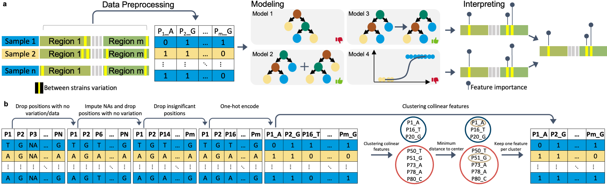
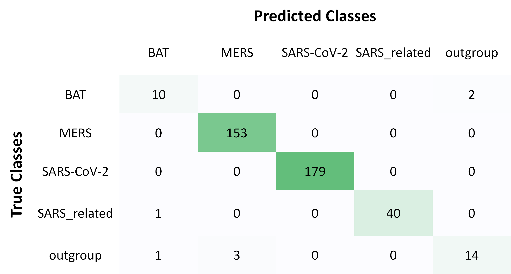
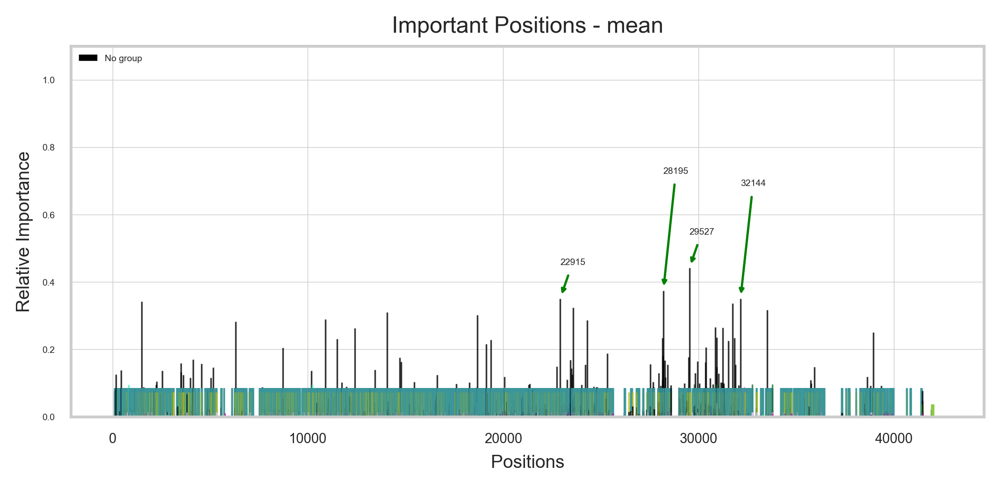

# deepBreaks: Prioritizing important regions of sequencing data for function prediction #

---
**deepBreaks** , a computational method, aims to identify important 
changes in association with the phenotype of interest 
using multi-alignment sequencing data from a population.
---
**Citation:**

Mahdi Baghbanzadeh, Tyson Dawson, Todd Oakley, Keith A. Crandall, Ali Rahnavard (2022+). **Prioritizing important regions of sequencing data for function prediction**, https://github.com/omicsEye/deeBreaks/.

---
# deepBreaks user manual #

## Contents ##
* [Features](#features)
* [deepBreaks](#deepBreaks)
    * [deepBreaks approach](#deepBreaks-approach)
    * [Installation](#installation)
      * [Windows Linux Mac](#Windows-Linux-Mac)
      * [Apple M1 MAC](#apple-m1-mac)
* [Getting Started with deepBreaks](#getting-started-with-deepBreaks)
    * [Test deepBreaks](#test-omeClust)
    * [Options](#options) 
    * [Input](#input)
    * [Output](#output)
    * [Demo](#demo)
* [Tutorials for normalized mutual information calculation](#tutorials-for-normalized-mutual-information-calculation)
* [Applications](#applications)
  * [Coronaviruses](#coronaviruses)
* [Support](#Support)
------------------------------------------------------------------------------------------------------------------------------
# Features #
1. Generic software that can handle any kind of sequencing data and phenotypes
2. One place to do all analysis and producing high-quality visualizations
3. Optimized computation
4. User-friendly software
5. Provides a predictive power of most discriminative positions in a sequencing data
# DeepBreaks #
## deepBreaks approach ##


## INSTALLATION ##
* First install *conda*  
Go to the [Anaconda website](https://www.anaconda.com/) and download the latest version for your operating system.  
* For Windows users: DO NOT FORGET TO ADD CONDA TO your system PATH*
* Second is to check for conda availability  
open a terminal (or command line for Windows users) and run:
```
conda --version
```
it should out put something like:
```
conda 4.9.2
```
<span style="color:#fc0335">if not, you must make *conda* available to your system for further steps.</span>
if you have problems adding conda to PATH, you can find instructions [here](https://docs.anaconda.com/anaconda/user-guide/faq/).  

### Windows Linux Mac ###
If you are **NOT** using an **Apple M1 MAC** please go to the [Apple M1 MAC](#apple-m1-mac) for installation instructions.  
<span style="color:#033C5A">*If you have a working conda on your system, you can safely skip to step three*</span>.
1) Create a new conda environment (let's call it deepBreaks_env) with the following command:
```
conda create --name deepBreaks_env python=3.8
```
2) Activate your conda environment:
```commandline
conda activate deepBreaks_env 
```
3) Install *deepBreaks*:
you can directly install if from GitHub:
```commandline
python -m pip install git+https://github.com/omicsEye/deepbreaks
```
### Apple M1 MAC ###
1) Update/install Xcode Command Line Tools
  ```commandline
  xcode-select --install
  ```
2) Install [Brew](https://brew.sh/index_fr)
  ```commandline
  /bin/bash -c "$(curl -fsSL https://raw.githubusercontent.com/Homebrew/install/HEAD/install.sh)"
  ```
3) Install libraries for brew
  ```commandline
  brew install cmake libomp
  ```
4) Install miniforge
  ```commandline
  brew install miniforge
  ```
5) Close the current terminal and open a new terminal
6) Create a new conda environment (let's call it deepBreaks_env) with the following command:
  ```commandline
  conda create --name deepBreaks_env python=3.8
  ```
7) Activate the conda environment
  ```commandline
  conda activate deepBreaks_env
  ```
8) Install packages from Conda
  ```commandline
  conda install numpy scipy scikit-learn==0.23.2
  ```
  Then
  ```commandline
  conda install lightgbm
  pip install xgboost
  ```
9) Finally, install *deepBreaks*:
you can directly install if from GitHub:
```commandline
python -m pip install git+https://github.com/omicsEye/deepbreaks
```

------------------------------------------------------------------------------------------------------------------------------

# Getting Started with deepBreaks #

## Test deepBreaks ##

To test if deepBreaks is installed correctly, you may run the following command in the terminal:

```#!cmd
deepBreaks -h
```
Which yields deepBreaks command line options.
```commandline
usage: deepBreaks -h 
--seqfile SEQFILE --seqtype SEQTYPE --meta_data META_DATA --metavar METAVAR --anatype {reg,cl} [--fraction FRACTION]

optional arguments:
  -h, --help            show this help message and exit
  --seqfile SEQFILE, -sf SEQFILE
                        files contains the sequences
  --seqtype SEQTYPE, -st SEQTYPE
                        type of sequence: nuc, amino-acid
  --meta_data META_DATA, -md META_DATA
                        files contains the meta data
  --metavar METAVAR, -mv METAVAR
                        name of the meta var (response variable). This is teh lable will be used as phenotype of interest to find genotypes related to it.
  --anatype {reg,cl}, -a {reg,cl}
                        type of analysis
  --fraction FRACTION, -fr FRACTION
                        fraction of main data to run
```


## Options ##

```
$ deepBreaks -h
```
## Input ##
1. `--seqfile` or `-sf` PATH to a sequence data file
2. `--seqtype` or `-st` sequence type, values are `amino-acid` and `nu` for nucleotides
3. `--meta_data` or `-md` PATH to metadata file
4. `--metavar` or `-mv` name of the meta variable
5. `--anatype` or `-a` analysis type, options are `reg` for regression and `cl` for classification
6. `--fraction` or `-fr` fraction of the main data (sequence positions) to run. it is optional, 
but you can enter a value between 0 and 1 to sample from the main data set.
## Output ##  
1. correlated positions. We group all the collinear positions together.
2. models summary. list of models and their performance metrics.
3. plot of the feature importance of the top models in *modelName_dpi.png* format.
4. csv files of feature importance based on top models containing, feature, importance, relative importance, 
group of the position (we group all the collinear positions together)
5. plots and csv file of average of feature importance of top models.
6. box plot (regression) or stacked bar plot (classification) for top positions of each model.

## Demo ##
```commandline
deepBreaks -sf D:/RahLab/deepBreaks/lite_mar/msa_RodOpsinLambdaMax.fasta -st amino-acid -md D:/RahLab/deepBreaks/lite_mar/meta_RodOpsinLambdaMax.tsv -mv LambdaMax -a reg
```
# Tutorials for normalized mutual information calculation ##
**vec_nmi(dat)** is the function for calculating *Normalize Mutual Information*. Rows of the `dat` file are 
samples and columns are positions in a sequence:
<center>

| | position_1 | position_2 | ... | position_n |
| -- | --------------- | --------------- | --------------- | ----------|
|sample 1 | A | C | ... | G |
|sample 2 | A | C | ... | G |
|sample 3 | T | C | ... | G |

</center>
and the output of the function is a symmetric dataframe with rows and columns equal to positions and the value of the 
intersection of each row and column is their normalazied mutual information:

<center>

| | position_1 | position_2 | ... | position_n |
| -- | --------------- | --------------- | --------------- | ----------|
|position_1 | 1 | 0.02 | ... | 0.64 |
|position_2 | 0.02 | 1 | ... | 0.02 |
|... | ... | ... | ... | ... |
|position_n | 0.64 | 0.02 | ... | 1 |

</center>

# Applications #
Here we try to use the **deepBreaks** on different datasets and elaborate on the results.  
## Coronaviruses ##
### Introduction ###
In this study we have a dataset of multi-aligned sequenced coronaviruses that labeled as Bat, SARS-CoV-2, MERS, 
SARS-related, and other. The initial size of the dataset was 1340 sequences with length of 42484. Our aim is to first, 
train high-performing machine-learning models to predict the member of the coronavirus family based on its sequence, 
and second, based on the top models, report the most discriminative positions in the sequence data that was 
mostly informative to the models. Consequently, based on the positions, we can then find out which specific 
parts that leads to a certain functionality is discriminative. The complete code for this example is 
under [examples directory](https://github.com/omicsEye/deepbreaks/tree/master/examples).  
After data preprocessing, the shape of the data reduced to 1239 sequences, 3 classes, and 2325 positions. It is worth 
mentioning that during the preprocessing, we kept only the SNPs, and amon those SNPs, we clustered the highly correlated
SNPs, and use only of the cluster members as the representative of that group.  
### Results ###
The results of the models that are fitted to the data with 10-fold crosse validation are as follows:  
Below, is the confusion matrix resulted on the test data with the Random Forest Classifier:
<p align="center">

</p>
The important positions are as follows:  
<p align="center">



</p>
Please note that the positions that are in same clusters (highly correlated positions) are presented in the same color. 
The last plot with the tile "important Positions - mean", shows the average importance score of the top three models.

# Support #

* Please submit your questions or issues with the software at [Issues tracker](https://github.com/omicsEye/deepBreaks/issues).
