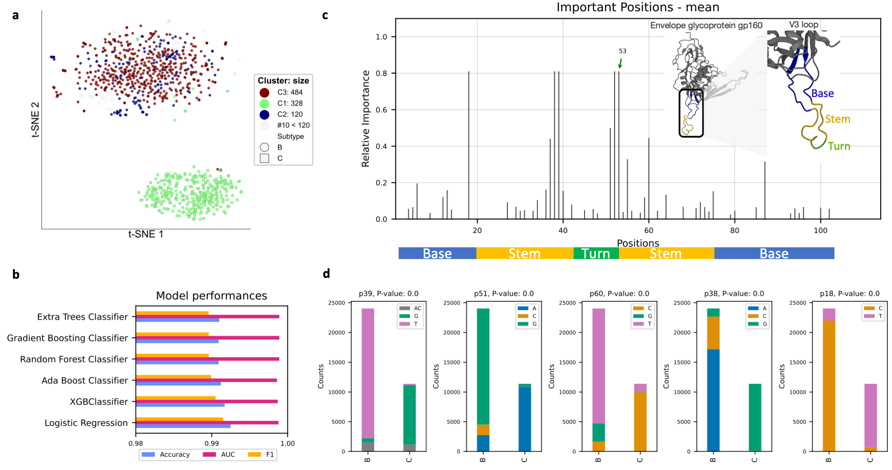

# deepBreaks #

---

**deepBreaks** , a computational method, aims to identify important
changes in association with the phenotype of interest
using multi-alignment sequencing data from a population.

**Key features:**

* Generality, deepBreaks is a generic domain software that can be used for any application that deals sequencing data.
* Interpretation: Rather than checking all possible mutations (breaks), deepBreaks prioritizes only statistically
  promising candidate mutations.
* User-friendly software: one place to do all high-quality visualization and statistical.
* Computing optimization: since sequencing data can get large all modules have been written and benchmarked for
  computing time.
* Tutorial comes with a wide range of real-world applications.

---
**Citation:**

Mahdi Baghbanzadeh, Tyson Dawson, Todd Oakley, Keith A. Crandall, Ali Rahnavard (2022+). **Prioritizing important
regions of sequencing data for function prediction**, https://github.com/omicsEye/deeBreaks/.

---

# deepBreaks user manual #

## Contents ##

* [Features](#features)
* [deepBreaks](#deepBreaks)
    * [deepBreaks approach](#deepBreaks-approach)
    * [Installation](#installation)
      * [Windows Linux Mac](#Windows-Linux-Mac)
      * [Apple M1 MAC](#apple-m1-mac)
* [Getting Started with deepBreaks](#getting-started-with-deepBreaks)
    * [Test deepBreaks](#test-omeClust)
    * [Options](#options) 
    * [Input](#input)
    * [Output](#output)
    * [Demo](#demo)
* [Applications](#applications)
  * [*deepBreaks* identifies amino acids associated with color sensitivity](#deepBreaksidentifiesaminoacidsassociatedwithcolorsensitivity)
  * [Novel insights of niche associations in the oral microbiome](#Novelinsightsofnicheassociationsintheoralmicrobiome)
  * [*deepBreaks* reveals important SARS-CoV-2 regions associated with Alpha and Delta variants](deepBreaksrevealsimportantSARS-CoV-2regionsassociatedwithAlphaandDeltavariants)
  * [*deepBreaks* identifies HIV regions with potentially important functions](deepBreaksidentifiesHIVregionswithpotentiallyimportantfunctions)
* [Support](#Support)
------------------------------------------------------------------------------------------------------------------------------
# Features #
1. Generic software that can handle any kind of sequencing data and phenotypes
2. One place to do all analysis and producing high-quality visualizations
3. Optimized computation
4. User-friendly software
5. Provides a predictive power of most discriminative positions in a sequencing data
# DeepBreaks #
## deepBreaks approach ##


## INSTALLATION ##
* First install *conda*  
Go to the [Anaconda website](https://www.anaconda.com/) and download the latest version for your operating system.  
* For Windows users: DO NOT FORGET TO ADD CONDA TO your system PATH*
* Second is to check for conda availability  
open a terminal (or command line for Windows users) and run:
```
conda --version
```
it should out put something like:
```
conda 4.9.2
```
<span style="color:#fc0335">if not, you must make *conda* available to your system for further steps.</span>
if you have problems adding conda to PATH, you can find instructions [here](https://docs.anaconda.com/anaconda/user-guide/faq/).  

### Windows Linux Mac ###
If you are **NOT** using an **Apple M1 MAC** please go to the [Apple M1 MAC](#apple-m1-mac) for installation instructions.  
<span style="color:#033C5A">*If you have a working conda on your system, you can safely skip to step three*</span>.  
If you are using windows, please make sure you have both git and Microsoft Visual C++ 14.0 or greater installed.
install [git](https://gitforwindows.org/)
[Microsoft C++ build tools](https://visualstudio.microsoft.com/visual-cpp-build-tools/)
In case you face issues with this step, [this link](https://github.com/pycaret/pycaret/issues/1254) may help you.
1) Create a new conda environment (let's call it deepBreaks_env) with the following command:
```
conda create --name deepBreaks_env python=3.9
```
2) Activate your conda environment:
```commandline
conda activate deepBreaks_env 
```
3) Install *deepBreaks*:
you can directly install if from GitHub:
```commandline
python -m pip install git+https://github.com/omicsEye/deepbreaks
```
### Apple M1 MAC ###
1) Update/install Xcode Command Line Tools
  ```commandline
  xcode-select --install
  ```
2) Install [Brew](https://brew.sh/index_fr)
  ```commandline
  /bin/bash -c "$(curl -fsSL https://raw.githubusercontent.com/Homebrew/install/HEAD/install.sh)"
  ```
3) Install libraries for brew
  ```commandline
  brew install cmake libomp
  ```
4) Install miniforge
  ```commandline
  brew install miniforge
  ```
5) Close the current terminal and open a new terminal
6) Create a new conda environment (let's call it deepBreaks_env) with the following command:
  ```commandline
  conda create --name deepBreaks_env python=3.9
  ```
7) Activate the conda environment
  ```commandline
  conda activate deepBreaks_env
  ```
8) Install packages from Conda
  ```commandline
  conda install lightgbm
  pip install xgboost
  ```
9) Finally, install *deepBreaks*:
you can directly install if from GitHub:
```commandline
python -m pip install git+https://github.com/omicsEye/deepbreaks
```

------------------------------------------------------------------------------------------------------------------------------

# Getting Started with deepBreaks #

## Test deepBreaks ##

To test if deepBreaks is installed correctly, you may run the following command in the terminal:

```#!cmd
deepBreaks -h
```
Which yields deepBreaks command line options.
```commandline
usage: deepBreaks -h 
--seqfile SEQFILE --seqtype SEQTYPE --meta_data META_DATA --metavar METAVAR --anatype {reg,cl} [--fraction FRACTION]

optional arguments:
  -h, --help            show this help message and exit
  --seqfile SEQFILE, -sf SEQFILE
                        files contains the sequences
  --seqtype SEQTYPE, -st SEQTYPE
                        type of sequence: nuc, amino-acid
  --meta_data META_DATA, -md META_DATA
                        files contains the meta data
  --metavar METAVAR, -mv METAVAR
                        name of the meta var (response variable). This is teh lable will be used as phenotype of interest to find genotypes related to it.
  --anatype {reg,cl}, -a {reg,cl}
                        type of analysis
  --fraction FRACTION, -fr FRACTION
                        fraction of main data to run
```


## Options ##

```
$ deepBreaks -h
```
## Input ##
1. `--seqfile` or `-sf` PATH to a sequence data file
2. `--seqtype` or `-st` sequence type, values are `amino-acid` and `nu` for nucleotides
3. `--meta_data` or `-md` PATH to metadata file
4. `--metavar` or `-mv` name of the meta variable
5. `--anatype` or `-a` analysis type, options are `reg` for regression and `cl` for classification
6. `--fraction` or `-fr` fraction of the main data (sequence positions) to run. it is optional, 
but you can enter a value between 0 and 1 to sample from the main data set.
7. `--redundant_threshold` or `-rt` threshold for the p-value of the statistical 
tests to drop redundant features. Default value is 0.25.
8. `--distance_threshold` or `-dth` threshold for the distance between positions to put them in clusters. 
features with distances <= than the threshold will be grouped together. Default values is 0.3.
9. `--top_models` or `-tm` number of top models to consider for merging the results. Default value is 3
10. `--plot` plot all the individual positions that are statistically significant. 
Depending on your data, this process may produce many plots.
11. `--gap` or `-gp` Threshold to drop positions that have GAPs above this proportion. 
Default value is 0.7, and it means that the positions that 70% or more GAPs will be dropped from the analysis.
12. `--write` During reading the fasta file we delete the positions that have GAPs over a  certain threshold that can 
be changed in the `gap_threshold` argument in the `read_data` function. As this may change the whole FASTA file,
you may want to save the FASTA file after this cleaning step.

## Output ##  
1. correlated positions. We group all the collinear positions together.
2. models summary. list of models and their performance metrics.
3. plot of the feature importance of the top models in *modelName_dpi.png* format.
4. csv files of feature importance based on top models containing, feature, importance, relative importance, 
group of the position (we group all the collinear positions together)
5. plots and csv file of average of feature importance of top models.
6. box plot (regression) or stacked bar plot (classification) for top positions of each model.

## Demo ##
```commandline
deepBreaks -sf lite_mar/msa_RodOpsinLambdaMax.fasta -st amino-acid -md lite_mar/meta_RodOpsinLambdaMax.tsv -mv
 LambdaMax -a reg  -dth 0.15 --plot
```
# Applications #
Here we try to use the **deepBreaks** on different datasets and elaborate on the results.
## *deepBreaks* identifies amino acids associated with color sensitivity ##
  

Opsins are genes involved in light sensitivity and vision, and when coupled with a light-reactive chromophore, the
absorbance of the resulting photopigment dictates physiological phenotypes like color sensitivity. We analyzed the 
amino acid sequence of rod opsins because previously published mutagenesis work established mechanistic connections
between 12 specific amino acid sites and phenotypes [Yokoyama et al. (2008)](https://doi.org/10.1073/pnas.0802426105). 
Therefore, we hypothesized that machine learning approaches could predict known associations between amino acid sites 
and absorbance phenotypes. We identified opsins expressed in
rod cells of vertebrates (mainly marine fishes) with absorption spectra measurements (λmax, the wavelength with the
highest absorption). The dataset contains 175 samples of opsin sequences. We next applied deepBreaks on this
dataset to find the most important sites contributing to the variations of λmax. 
This [Jupyter Notebook](https://github.com/omicsEye/deepbreaks/blob/master/examples/continuous_phenotype.ipynb) 
illustrates the steps.

## Novel insights of niche associations in the oral microbiome ##
  
Microbial species tend to adapt at the genome level to the niche in which they live. We hypothesize 
that genes with essential functions change based on where microbial species live. Here we use microbial strain 
representatives from stool metagenomics data of healthy adults from the
[Human Microbiome Project](https://doi.org/10.1038/nature11234). The input for deepBreaks consists of 1) an MSA file
with 1006 rows, each a representative strain of a specific microbial species, here Haemophilus parainfluenzae, with
49839 lengths; and 2) labels for deepBreaks prediction are body sites from which samples were collected. 
This [Jupyter Notebook](https://github.com/omicsEye/deepbreaks/blob/master/examples/discrete_phenotype.ipynb)
illustrates the steps.

## *deepBreaks* reveals important SARS-CoV-2 regions associated with Alpha and Delta variants ##

Variants occur with new mutations in the virus genome. Most mutations in the SARS-CoV-2 genome do not affect the
functioning of the virus. However, mutations in the spike protein of SARS-CoV-2, which binds to receptors on cells 
lining the inside of the human nose, may make the virus easier to spread or affect how well vaccines protect people. 
We are going to study the mutations in the spike protein of the sequences of Alpha (B.1.1.7): the first variant of 
concern described in the United Kingdom (UK) in late December 2020 and Delta (B.1.617.2): first reported in India in
December 2020. We used the publicly available data from the [GSAID](https://gisaid.org/) and obtained 900 sequences
of spike protein region of Alpha (450 samples) and Delta (450 samples) variants. Then, we used deepBreaks to analyze 
the data and find the most important (predictive) positions in these sequences in terms of classifying the variants. 
This
[Jupyter Notebook](https://github.com/omicsEye/deepbreaks/blob/master/examples/discrete_phenotype_SARS_Cov2_variants.ipynb) 
illustrates the steps.

## *deepBreaks* identifies HIV regions with potentially important functions ##

Subtypes of the human immunodeficiency virus type 1 (HIV-1) group M are different in the envelope (Env) glycoproteins 
of the virus. These parts of the virus are displayed on the surface of the virion and are targets for both neutralizing
antibody and cell-mediated immune responses. The third hypervariable domain (V3) of HIV-1 gp120 is a cysteine-bounded
loop structure usually composed of 105 nucleotides and labeled as the base (nu 1:26 and 75:105), stem
(nu 27:44 and 54:74), and turn (nu 45:53) regions [Lynch et al. (2009)](https://doi.org/10.1089%2Faid.2008.0219) .
Among all of the hyper-variable regions in gp120 (V1-V5), V3 is playing the main role in the virus infectivity
[Felsövályi et al. (2006)](https://doi.org/10.1089%2Faid.2006.22.703). 
Here we useare using deepBreaks to identify important regions in the V3 loop that are important in terms of associating
the V3 sequences V3 to subtypes B and C. We used the [Los Alamos HIV Database](www.hiv.lanl.gov) to gather the 
nucleotide sequences of the V3 loop of subtypes B and C. 
This [Jupyter Notebook](https://github.com/omicsEye/deepbreaks/blob/master/examples/discrete_phenotype_HIV.ipynb) 
illustrates the steps.


# Support #

* Please submit your questions or issues with the software at [Issues tracker](https://github.com/omicsEye/deepBreaks/issues).
